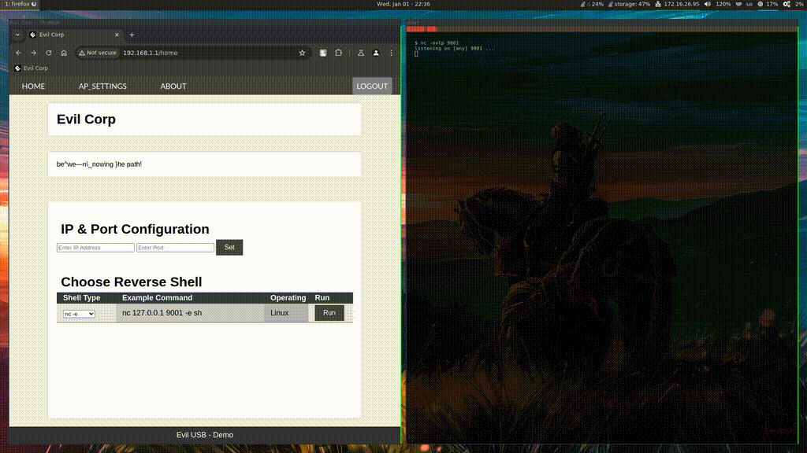
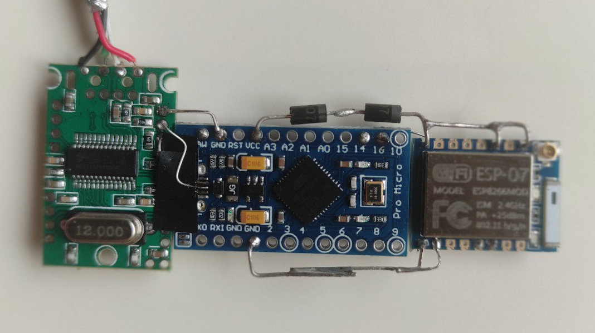
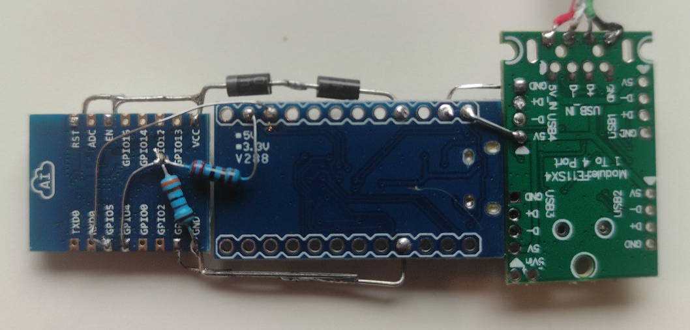
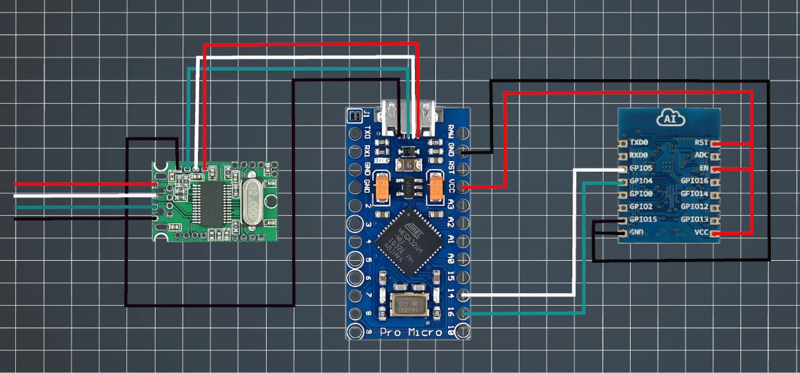
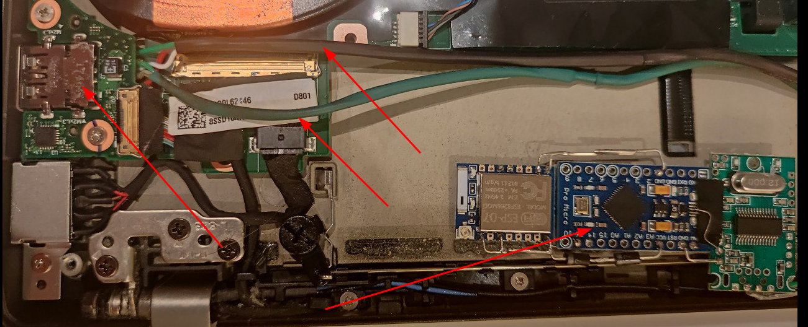
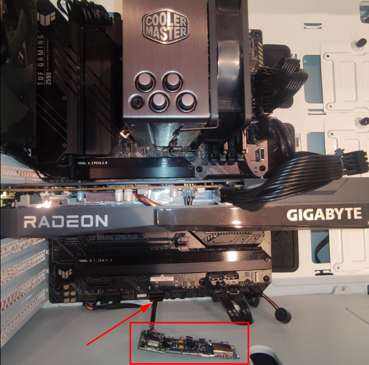
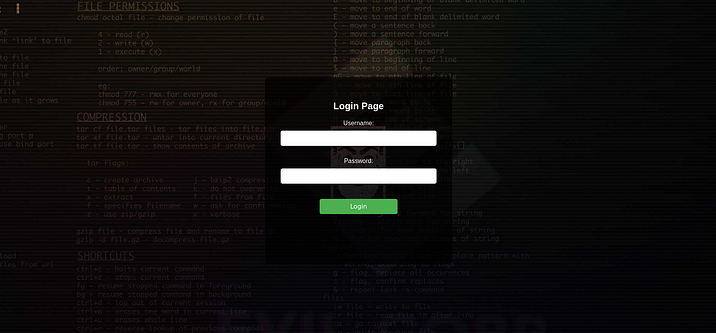
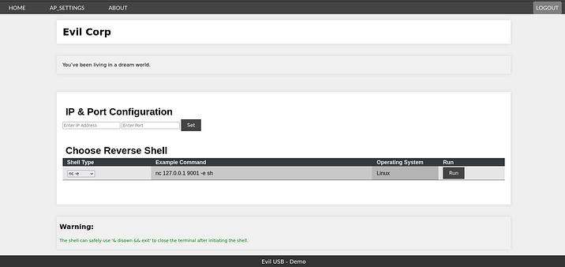
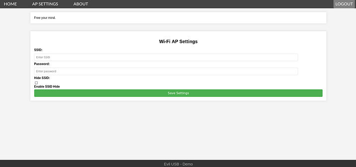

# ESP07CommandForge

## Description
Imagine transforming an ordinary laptop into a covert, wireless command execution hub. With this project, you can achieve just that by combining the ESP-07 Wi-Fi module and an Arduino Pro Micro. The ESP-07 acts as a discreet Wi-Fi access point, enabling remote devices to issue commands that the Arduino Pro Micro interprets and executes by emulating a keyboard through the HID (Human Interface Device) protocol. Seamlessly hidden within your laptop, this setup becomes a stealthy powerhouse. This Proof of Concept (POC) is crafted for educational purposes to inspire creativity and experimentation.



---

## Dependencies
### Hardware
- **ESP-07 Wi-Fi module** – Acts as a wireless command center.
- **Arduino Pro Micro** – Handles command execution by emulating a keyboard.
- **Voltage divider** – Composed of two resistors (e.g., 3.3kΩ and 2.2kΩ) to step down the Arduino's 5V TX signal to a safe 3.3V for the ESP RX pin.
- **Small USB hub (optional)** – For embedding the components while maintaining USB functionality.
- **Laptop or host device** – Houses and powers the setup discreetly.





### Software
- **Arduino IDE** – Essential for uploading sketches to the hardware.
- **HID Library** – Enables the Arduino Pro Micro to emulate a keyboard.
- **ESP8266 File Uploader** – Uploads the web interface files to the ESP-07.
- **JSON Parsing Library** – Structures and processes commands efficiently.

---

## Instructions

### Install Dependencies
To ensure your Arduino code works correctly, you need to install the necessary dependencies. Ensure all dependencies are installed before uploading the code to avoid compilation errors and ensure smooth operation.

&nbsp;

### Install ESP8266 Sketch Data
To install and use the ESP8266 Sketch Data Upload Tool in the Arduino IDE:

&nbsp;

1. **Install the ESP8266 Board Package**
   - Ensure you have the ESP8266 board package installed in the Arduino IDE.
   - Open **File > Preferences** in Arduino IDE.
   - Add the following URL to Additional Board Manager URLs:
     - `http://arduino.esp8266.com/stable/package_esp8266com_index.json`

&nbsp;

2. **Download the ESP8266 Sketch Data Upload Tool**
   - The tool isn't included by default. You'll need to download it:
   - Go to the ESP8266FS [GitHub](https://github.com/esp8266/arduino-esp8266fs-plugin/releases/tag/0.5.0)1 page. 
   - Download the ZIP file from the Releases section.

&nbsp;

3. **Install the Tool**
   - Unzip the downloaded file.
   - Navigate to the tools folder in your Arduino installation directory:
     - For example:
       - Windows: `Documents/Arduino/tools`
       - macOS/Linux: `~/Arduino/tools`
   - Create a directory called `ESP8266FS` in the tools folder if it doesn't exist.
   - Place the unzipped contents of the tool inside the `ESP8266FS` directory.
   - The final path should look something like:
     - `Arduino/tools/ESP8266FS/tool/esp8266fs.jar`

&nbsp;

4. **Restart the Arduino IDE** to load the plugin.

&nbsp;

5. **Prepare the SPIFFS Data**
   - Create a folder named `data` inside your sketch folder.
   - Add any files you want to upload to SPIFFS (e.g., HTML, CSS, JavaScript, text files).

&nbsp;

6. **Upload Files to SPIFFS**
   - Select your ESP8266 board and the correct COM port.
   - Go to **Tools > ESP8266 Sketch Data Upload**.
   - The tool will package the files in the `data` folder and upload them to the ESP8266 SPIFFS.

&nbsp;

### Increasing SPIFFS Storage Space
To increase the space available for sketch data in the Arduino IDE, follow these steps:

&nbsp;

**Opening Flash Memory Options:**
- In the Arduino IDE, go to **Tools > Flash Size**.
- You will see options like:
- `1M (FS:512KB OTA:~246KB)`
- `1M (FS:256KB OTA:~502KB)`
- The number represents the total flash memory (e.g., 1MB), and the part in parentheses represents the allocated space for the file system (FS) and Over-The-Air (OTA) updates.

&nbsp;

**Choosing a Larger SPIFFS Size:**
- Choose the configuration that allocates **512KB** for SPIFFS (FS) and leaves **~246KB** for OTA updates, such as: `1M (FS:512KB OTA:~246KB)`

&nbsp;

**Re-upload Data:**
- After changing the partitioning, you need to re-upload the code and sketch data to the device, as existing data will be erased.

&nbsp;

### Install the ArduinoJson Library
If you haven't already installed the ArduinoJson library, follow these steps:
- Open Arduino IDE.
- Go to **Sketch > Include Library > Manage Libraries**.
- Search for "ArduinoJson" and click Install.

&nbsp;

### 1. Setting Up the ESP-07
1. Open the `sketch_esp-07.ino` file in the Arduino IDE.
2. Place the `data` folder containing the following files in the same directory as the sketch:
   - `404.html`
   - `about.html`
   - `E-Corp.jpg`
   - `favicon-48x48.png`
   - `home.html`
   - `login.html`
   - `wifi_settings.html`
3. Connect the ESP-07 module to your computer.
4. Upload the sketch to the ESP-07 using the Arduino IDE.
5. Use **Tools > ESP8266 Sketch Data Upload** in the Arduino IDE to upload the `data` folder contents to the ESP-07’s filesystem.

&nbsp;

### 2. Programming the Arduino Pro Micro
1. Open the `sketch_proMicro.ino` file in the Arduino IDE.
2. Connect the Arduino Pro Micro to your computer via a USB cable.
3. Upload the sketch to the Arduino Pro Micro.

&nbsp;

### 3. Hardware Integration
#### Connect the ESP-07 and Arduino Pro Micro:
   - **Arduino TX (5V)** → **Voltage Divider** → **ESP RX (3.3V)**:
     - Use a voltage divider with a **3.3kΩ resistor** connected to the Arduino TX pin and a **2.2kΩ resistor** connected to ground. 
     - The midpoint of the resistors provides a safe 3.3V signal for the ESP RX pin.
     
   - **ESP TX (3.3V)** → **Arduino RX** (direct connection, as the Arduino RX pin is 5V tolerant).
   
   - **Powering the ESP-07:**
	- If using a 5V Arduino Pro Micro, add two diodes in series to step down the voltage from 5V to approximately 3.3V to power the ESP-07.

	
  - When powering the setup through a USB hub, confirm the hub provides sufficient power (500mA or more) to handle the ESP-07’s requirements without voltage drops.

```
        Arduino Pro Micro                            ESP-07  
       __________________                           __________  
      |                  |                         |          |  
      |                  |                 +-----> | GPIO 15  |  
      |             GND  | <---------------+-----> | GND      |  
      |                  |                         |          |  
      |                  |                         |          |  
      |                  |                         |          |  
      |                  |                 +-----> | EN       |  
      |                  |                 +-----> | RST      |  
      |             VCC  | <---|>|--|>|----+-----> | VCC      |  
      |                  |  2 x (1N4007)           |          |  
      |                  |                         |          |  
      |                  |                         |          |  
      |             TX16 | <-- Voltage Divider --> | RX (4)   |  
      |                  |                         |          |  
      |             RX14 | <---------------------> | TX (5)   |  
      |                  |                         |          |  
      |__________________|                         |__________|  
  
  
  
  
  
Voltage Divider Example:  
    Arduino TX (5V) ----- R1 (2.2kΩ) ----- ESP RX (3.3V)  
                                  |  
                              R2 (3.3kΩ)  
                                  |  
                                 GND  
  
  
Legend:  
- Power Connection:  
  - If using a 5V Arduino Pro Micro, use two diodes in series (1N4007)  
    to drop VCC from 5V to 3.3V for ESP-07.  
  
- Communication:  
  - Arduino TX (5V) → Voltage Divider   → ESP RX (3.3V).  
  - ESP TX (3.3V)   → Direct Connection → Arduino RX  
  
- Voltage Divider: Ensure the lower resistor (R2) connects to GND to   
  properly drop the voltage.  
  
- EN (Enable):  
  - Connect the EN pin of the ESP-07 to 3.3V.   
  - This pin must be high for the ESP-07 to function.  
  
- RST (Reset):  
  - Connect the RST pin of the ESP-07 to 3.3V.  
  - This ensures the module is not held in reset mode.  
  
- GND: Ensure GND pins of both devices are connected.  
  
- GPIO 15:  
  - Connect the GPIO 15 pin of the ESP-07 to GND.  
  - This is a boot configuration pin that must be grounded,  
    for the ESP-07 to boot into the correct mode.
```
&nbsp;



&nbsp;

### 4. Hide device 
Laptop
- If you're using a laptop, conceal the setup by placing it in the bay designed for an additional SSD or a secondary battery. 
- These compartments often provide enough space to discreetly house the ESP-07 and Arduino Pro Micro. 
- Ensure the wiring does not obstruct other components and that the laptop can close securely.



&nbsp;

Desktop
- For desktop setups, hide the device behind the motherboard inside the case. 
- Use double-sided adhesive tape or zip ties to secure the components in place.



&nbsp;

### 5. Using the Setup
- Power on the device and connect to the ESP-07 access point with the following credentials:
	- **SSID**: `ESP8266-Access-Point`
	- **Password**: `123456789`

&nbsp;

- Access the HTML interface via a web browser.\
  - Username: `admin`
  - Password: `admin`

 &nbsp;
  
- Configure Wi-Fi settings or execute commands using the provided interface.







&nbsp;

---

## Disclaimer

- This project is a Proof of Concept (POC) designed for educational purposes only. 
- The author bears no responsibility for any misuse, illegal activity, or consequences arising from this project. 
- **Tinker responsibly!**  ⚠️
